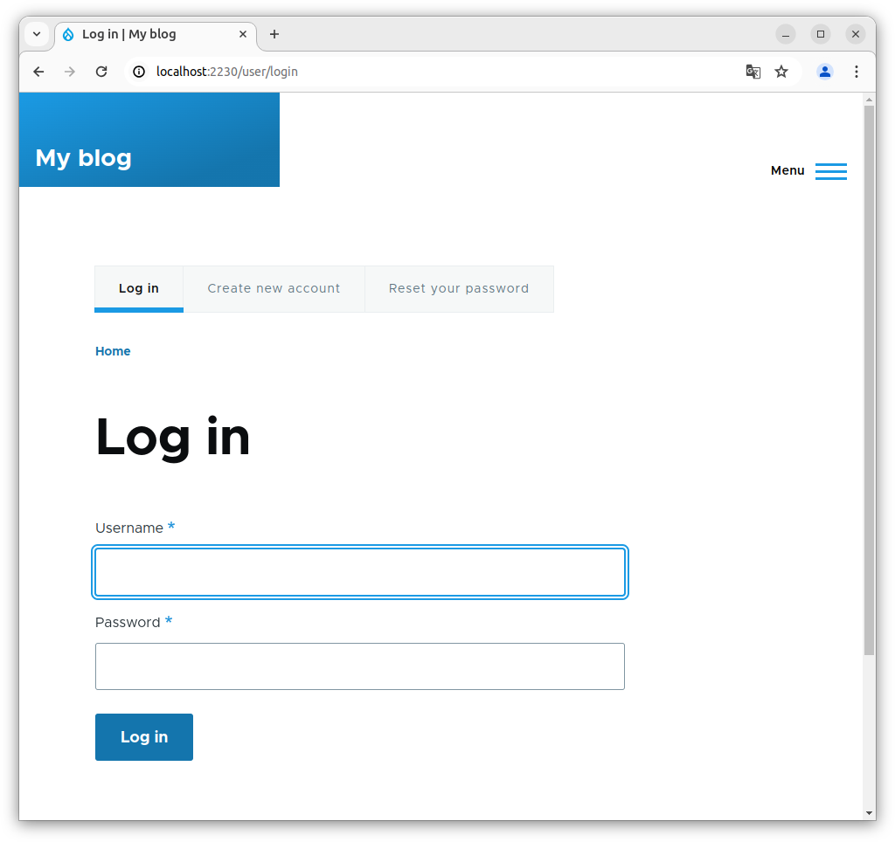

# Task 001 - Configure Auto Scaling


* Follow the instructions in the tutorial [Getting started with Amazon EC2 Auto Scaling](https://docs.aws.amazon.com/autoscaling/ec2/userguide/GettingStartedTutorial.html) to create a launch template.

* [CLI Documentation](https://docs.aws.amazon.com/cli/latest/reference/autoscaling/)

## Pre-requisites

* Networks (RTE-TABLE/SECURITY GROUP) set as at the end of the Labo2.
* 1 AMI of your Drupal instance
* 0 existing ec2 (even is in a stopped state)
* 1 RDS Database instance - started
* 1 Elastic Load Balancer - started

## Create a new launch template. 

[AWS CLI Doc - create-launch template](https://awscli.amazonaws.com/v2/documentation/api/latest/reference/ec2/create-launch-template.html)

|Key|Value|
|:--|:--|
|Name|LT-DEVOPSTEAM[XX]|
|Version|v1.0.0|
|Tag|Name->same as template's name|
|AMI|Your Drupal AMI|
|Instance type|t3.micro (as usual)|
|Subnet|Your subnet A|
|Security groups|Your Drupal Security Group|
|IP Address assignation|Do not assign|
|Storage|Only 10 Go Storage (based on your AMI)|
|Advanced Details/EC2 Detailed Cloud Watch|enable|
|Purchase option/Request Spot instance|disable|

```
[INPUT]
//cli command is optionnal. Important is the screen shot to delivery in next step (testing and validation)
aws ec2 create-launch-template --launch-template-name "LT-DEVOPSTEAM11" --launch-template-data '{"ImageId": "ami-0cd63b7a25932eb7e", "InstanceType": "t3.micro", "KeyName": "CLD_KEY_DRUPAL_DEVOPSTEAM11", "SecurityGroupIds": ["sg-09866346f8d32d27d"]}'

[OUTPUT]
{
    "LaunchTemplate": {
        "LaunchTemplateId": "lt-0b4199a9207ce9b67",
        "LaunchTemplateName": "LT-DEVOPSTEAM11",
        "CreateTime": "2024-04-17T18:10:34+00:00",
        "CreatedBy": "arn:aws:iam::709024702237:user/CLD_DEVOPSTEAM11",
        "DefaultVersionNumber": 1,
        "LatestVersionNumber": 1
    }
}
```

## Create an autoscaling group

* Choose launch template or configuration

  [AWS CLI Doc - create-auto-scaling group](https://awscli.amazonaws.com/v2/documentation/api/latest/reference/autoscaling/create-auto-scaling-group.html)
  
  [AWS CLI Doc - put-scaling-policy](https://docs.aws.amazon.com/cli/latest/reference/autoscaling/put-scaling-policy.html)

|Specifications|Key|Value|
|:--|:--|:--|
|Launch Configuration|Name|ASGRP_DEVOPSTEAM[XX]|
||Launch configuration|Your launch configuration|
|Instance launch option|VPC|Refer to infra schema|
||AZ and subnet|AZs and subnets a + b|
|Advanced options|Attach to an existing LB|Your ELB|
||Target group|Your target group|
|Health check|Load balancing health check|Turn on|
||health check grace period|10 seconds|
|Additional settings|Group metrics collection within Cloud Watch|Enable|
||Health check grace period|10 seconds|
|Group size and scaling option|Desired capacity|1|
||Min desired capacity|1|
||Max desired capacity|4|
||Policies|Target tracking scaling policy|
||Target tracking scaling policy Name|TTP_DEVOPSTEAM[XX]|
||Metric type|Average CPU utilization|
||Target value|50|
||Instance warmup|30 seconds|
||Instance maintenance policy|None|
||Instance scale-in protection|None|
||Notification|None|
|Add tag to instance|Name|AUTO_EC2_PRIVATE_DRUPAL_DEVOPSTEAM[XX]|

```
[INPUT]
//cli command is optionnal. Important is the screen shot to delivery in next step (testing and validation)
aws autoscaling create-auto-scaling-group \
	--auto-scaling-group-name "ASGRP_DEVOPSTEAM11" \
	--min-size 1 \
	--desired-capacity 1 \
	--max-size 4 \
	--health-check-type ELB \
    --target-group-arns "arn:aws:elasticloadbalancing:eu-west-3:709024702237:targetgroup/TG-DEVOPSTEAM11/90cb43924e683a66" \
    --health-check-type "ELB" \
	--launch-template "LaunchTemplateId=lt-0b4199a9207ce9b67" \
	--vpc-zone-identifier "subnet-0d8a7c4a04c59189d,subnet-038104e68d83eeda0" \
	--no-new-instances-protected-from-scale-in \
	--tags "ResourceId=ASGRP_DEVOPSTEAM11,ResourceType=auto-scaling-group,Key=Name,Value=AUTO_EC2_PRIVATE_DRUPAL_DEVOPSTEAM11,PropagateAtLaunch=true" \
	--health-check-grace-period 10 \
	--default-instance-warmup 30


[NO OUTPUT]

[INPUT]
aws autoscaling put-scaling-policy \
    --auto-scaling-group-name ASGRP_DEVOPSTEAM11 \
    --policy-name TTP_DEVOPSTEAM11 \
    --policy-type "TargetTrackingScaling" \
    --target-tracking-configuration '{"PredefinedMetricSpecification":{"PredefinedMetricType":"ASGAverageCPUUtilization"},"TargetValue":50}' \
    --estimated-instance-warmup 30
    
[OUTPUT]
{
    "PolicyARN": "arn:aws:autoscaling:eu-west-3:709024702237:scalingPolicy:780bf097-f6ad-45ca-8da3-d02d876e52be:autoScalingGroupName/ASGRP_DEVOPSTEAM11:policyName/TTP_DEVOPSTEAM11",
    "Alarms": [
        {
            "AlarmName": "TargetTracking-ASGRP_DEVOPSTEAM11-AlarmHigh-0afc16d8-a3ee-46a3-9a99-19b1384f33ab",
            "AlarmARN": "arn:aws:cloudwatch:eu-west-3:709024702237:alarm:TargetTracking-ASGRP_DEVOPSTEAM11-AlarmHigh-0afc16d8-a3ee-46a3-9a99-19b1384f33ab"
        },
        {
            "AlarmName": "TargetTracking-ASGRP_DEVOPSTEAM11-AlarmLow-0accc4f4-8756-4c85-bf51-5dbc04021b03",
            "AlarmARN": "arn:aws:cloudwatch:eu-west-3:709024702237:alarm:TargetTracking-ASGRP_DEVOPSTEAM11-AlarmLow-0accc4f4-8756-4c85-bf51-5dbc04021b03"
        }
    ]
}

```

* Result expected

The first instance is launched automatically.

Test ssh and web access.

```
[INPUT]
//ssh login
ssh devopsteam11@15.188.43.46  -i "~/.ssh/CLD_KEY_DMZ_DEVOPSTEAM11.pem" -L 2226:10.0.11.133:22 -L 2230:internal-ELB-DEVOPSTEAM11-353931265.eu-west-3.elb.amazonaws.com:8080

[OUTPUT]
Linux ip-10-0-0-5 6.1.0-18-cloud-amd64 #1 SMP PREEMPT_DYNAMIC Debian 6.1.76-1 (2024-02-01) x86_64

The programs included with the Debian GNU/Linux system are free software;
the exact distribution terms for each program are described in the
individual files in /usr/share/doc/*/copyright.

Debian GNU/Linux comes with ABSOLUTELY NO WARRANTY, to the extent
permitted by applicable law.
Last login: Wed Apr 17 19:26:24 2024 from 188.155.82.233

[INPUT]
ssh bitnami@localhost -p 2226 -i "~/.ssh/CLD_KEY_DRUPAL_DEVOPSTEAM11.pem"
[OUTPUT]
Linux ip-10-0-11-133 5.10.0-28-cloud-amd64 #1 SMP Debian 5.10.209-2 (2024-01-31) x86_64

The programs included with the Debian GNU/Linux system are free software;
the exact distribution terms for each program are described in the
individual files in /usr/share/doc/*/copyright.

Debian GNU/Linux comes with ABSOLUTELY NO WARRANTY, to the extent
permitted by applicable law.
       ___ _ _                   _
      | _ |_) |_ _ _  __ _ _ __ (_)
      | _ \ |  _| ' \/ _` | '  \| |
      |___/_|\__|_|_|\__,_|_|_|_|_|
  
  *** Welcome to the Bitnami package for Drupal 10.2.3-1        ***
  *** Documentation:  https://docs.bitnami.com/aws/apps/drupal/ ***
  ***                 https://docs.bitnami.com/aws/             ***
  *** Bitnami Forums: https://github.com/bitnami/vms/           ***
Last login: Wed Apr 17 19:27:33 2024 from 10.0.0.5
```

```
//screen shot, web access (login)
```


