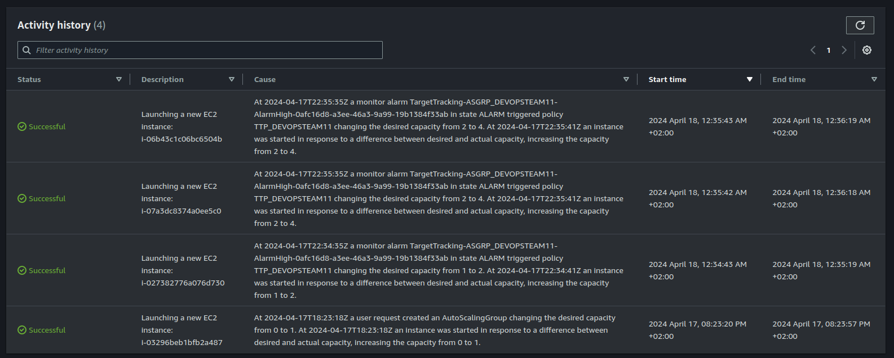

# Task 003 - Test and validate the elasticity


## Simulate heavy load to trigger a scaling action

* [Install the package "stress" on your Drupal instance](https://www.geeksforgeeks.org/linux-stress-command-with-examples/)

* [Install the package htop on your Drupal instance](https://www.geeksforgeeks.org/htop-command-in-linux-with-examples/)

* Check how many vCPU are available (with htop command)

```
[INPUT]
htop

[OUTPUT]
//copy the part representing vCPus, RAM and swap usage
    0[                                                        0.0%]   Tasks: 31, 410 thr; 1 running
    1[|                                                       0.7%]   Load average: 0.08 0.04 0.00 
  Mem[|||||||||||||||||||||||||||||||||||||||||||||||||||268M/951M]   Uptime: 04:04:07
  Swp[|                                                 2.25M/635M]
```

### Stress your instance

```
[INPUT]
//stress command
stress --cpu 4

[OUTPUT]
//copy the part representing vCPus, RAM and swap usage
//tip : use two ssh sessions....
    0[|||||||||||||||||||||||||||||||||||||||||||||||||||100.0%]   Tasks: 39, 410 thr; 2 running
    1[|||||||||||||||||||||||||||||||||||||||||||||||||||100.0%]  Load average: 3.75 1.76 0.69 
  Mem[|||||||||||||||||||||||||||||||||||||||||||||||||||272M/951M]   Uptime: 04:10:28
  Swp[|                                                 2.25M/635M]
```

* (Scale-IN) Observe the autoscaling effect on your infa


```
[INPUT]
//Screen shot from cloud watch metric
```


```
//TODO screenshot of ec2 instances list (running state)
```


```
//TODO Validate that the various instances have been distributed between the two available az.
[INPUT]
//aws cli command
aws ec2 describe-instances --filters "Name=tag:aws:autoscaling:groupName,Values=ASGRP_DEVOPSTEAM11" --query "Reservations[*].Instances[*].{Instance:InstanceId,AZ:Placement.AvailabilityZone}" --output table

[OUTPUT]
---------------------------------------
|          DescribeInstances          |
+-------------+-----------------------+
|     AZ      |       Instance        |
+-------------+-----------------------+
|  eu-west-3a |  i-027382776a076d730  |
|  eu-west-3a |  i-07a3dc8374a0ee5c0  |
|  eu-west-3b |  i-03296beb1bfb2a487  |
|  eu-west-3b |  i-06b43c1c06bc6504b  |
+-------------+-----------------------+
```

```
//TODO screenshot of the activity history
```


```
//TODO screenshot of the cloud watch alarm target tracking
```

* (Scale-OUT) As soon as all 4 instances have started, end stress on the main machine.

[Change the default cooldown period](https://docs.aws.amazon.com/autoscaling/ec2/userguide/ec2-auto-scaling-scaling-cooldowns.html)

```
//TODO screenshot from cloud watch metric
```

```
//TODO screenshot of ec2 instances list (terminated state)
```

```
//TODO screenshot of the activity history
```

## Release Cloud resources

Once you have completed this lab release the cloud resources to avoid
unnecessary charges:

* Terminate the EC2 instances.
    * Make sure the attached EBS volumes are deleted as well.
* Delete the Auto Scaling group.
* Delete the Elastic Load Balancer.
* Delete the RDS instance.

(this last part does not need to be documented in your report.)

## Delivery

Inform your teacher of the deliverable on the repository (link to the commit to retrieve)