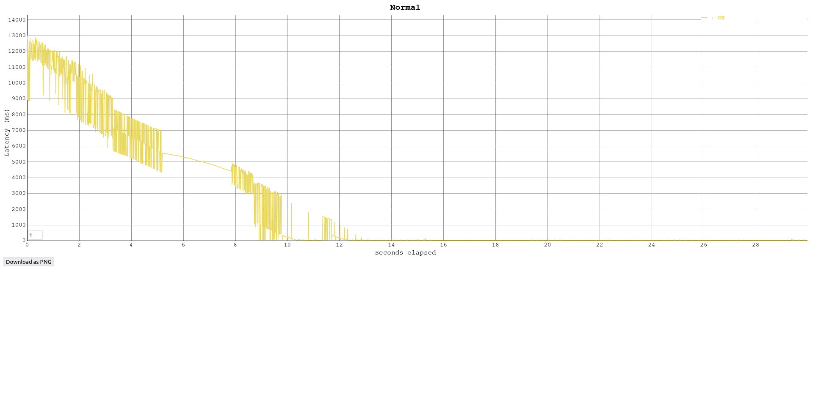
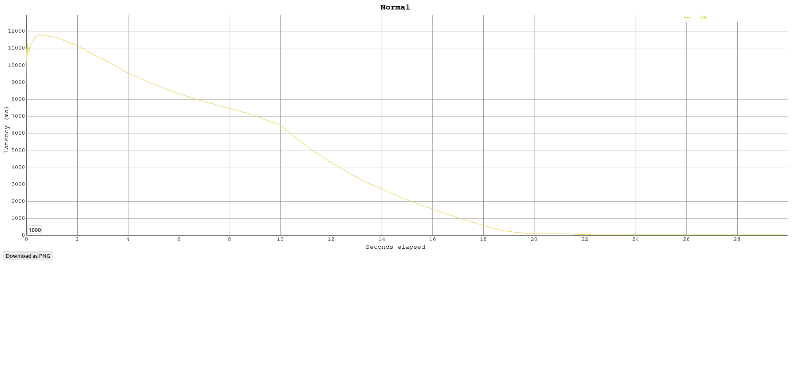
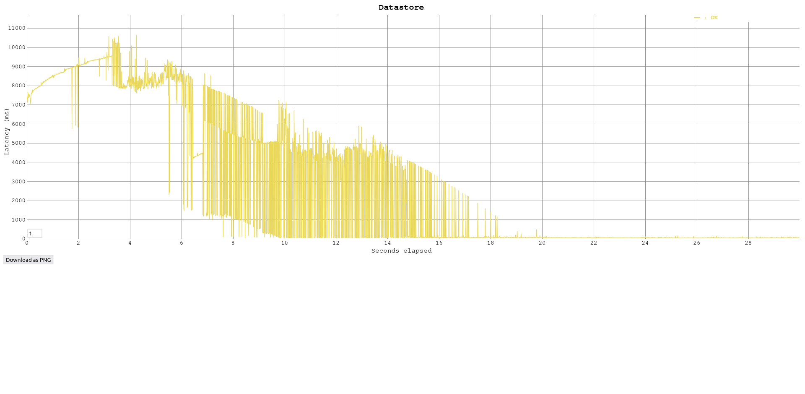
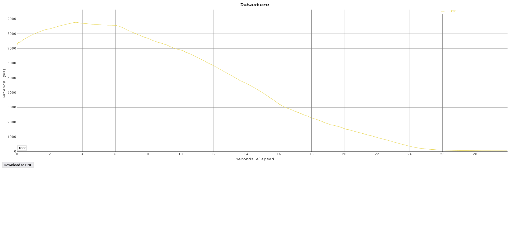

## Task 3: Test the performance of Datastore writes

In this task you will performance test the App Engine platform with a
load generator. You will compare the performance of normal request
processing and request processing that involves Datastore write
operations.

As the Servlets are deployed with Automatic Scaling, there is a danger
of consuming a lot of resources while testing, and burning through a
lot of money. Google gave you a coupon with some money that was put
into a billing account. Projects can have spending limits, but by
default it is unlimited. Before starting the performance test, you
have to set a reasonable daily spending limit.

Set a daily spending limit on the project as follows:

- In the Cloud Platform console navigate to **App Engine** >
  **Settings**. Click on **Edit**. Enter a daily spending limit of
  **$1.00**. (Note: Google has removed this functionality in January 2020. There is no replacement for it yet. Skip this step, but observe how many credits you have left before and after the performance tests. You can also limit the number of instances with an optional configuration of the autoscaling algorithm: In the file `appengine-web.xml` in the `<automatic-scaling>` element add a `<max-instances>` element with a small value (3, 4, ...). See <https://cloud.google.com/appengine/docs/standard/java/config/appref#scaling_elements>. An alternative is to use **Budgets & alerts**. In the Cloud Platform console navigate to **Billing** > **Budgets & alerts**. Create a new budget for the month for an amount of **$1.00** and optionally set the actions associated with the alert.)

Conduct the performance tests as follows:

1. You should already have vegeta installed from previous labs. If not, see <https://blog.absyah.dev/super-simple-guide-for-load-testing-using-vegeta#heading-install-vegeta>.

2. First test the performance of normal request processing using the
   Servlet generated by the wizard.
   - Prepare an "attack" using vegeta.
   
   - In the App Engine console open the **Dashboard**.
   
   - Run the attack.
   
   - In the dashboard observe the graph of the incoming requests, the
     number of instances and the latency.
   
3. Test the performance of the Servlet that writes to the Datastore.

4. At the end of the tests observe in detail how much resources were
   used. In the console click on **Quota Details**.

5. If you are running out of resources because of the monthly spending
   limit, increase it carefully by a dollar or two.

Deliverables:

- For each performance test, write the command used to generate the attack with vegeta and copy the file generated by the vegeta plot command.

  Normal request:

```
[INPUT]
echo "GET https://cloud-heig-24.ew.r.appspot.com" | vegeta attack -duration=30s -rate=100 | tee normal.bin | vegeta report

[OUTPUT]
Requests      [total, rate, throughput]         3000, 100.04, 99.92
Duration      [total, attack, wait]             30.026s, 29.989s, 36.261ms
Latencies     [min, mean, 50, 90, 95, 99, max]  27.925ms, 2.202s, 39.694ms, 7.801s, 10.655s, 12.302s, 13.004s
Bytes In      [total, mean]                     1485000, 495.00
Bytes Out     [total, mean]                     0, 0.00
Success       [ratio]                           100.00%
Status Codes  [code:count]                      200:3000  
Error Set:
```

```
[INPUT]
vegeta plot -title=Normal normal.bin > normal.html
```

[OUTPUT]

The scale is to 1 milisecond:



The scale is to 1 second:



```
[INPUT]
echo "GET https://cloud-heig-24.ew.r.appspot.com/datastorewrite?_kind=course" | vegeta attack -duration=30s -rate=100 | tee datastore.bin | vegeta report

[OUTPUT]
Requests      [total, rate, throughput]         3000, 100.03, 99.77
Duration      [total, attack, wait]             30.069s, 29.99s, 79.193ms
Latencies     [min, mean, 50, 90, 95, 99, max]  45.418ms, 2.846s, 82.893ms, 8.535s, 9.104s, 9.56s, 10.639s
Bytes In      [total, mean]                     132000, 44.00
Bytes Out     [total, mean]                     0, 0.00
Success       [ratio]                           100.00%
Status Codes  [code:count]                      200:3000  
Error Set:
```


```
[INPUT]
vegeta plot -title=Datastore datastore.bin > datastore.html
```

[OUTPUT]

The scale is to 1 milisecond:



The scale is to 1 second:



You can find the result files [here](result/). 

  

- What response times do you observe for each Servlet?

  ```
  For normal usage:
  The results from the Vegeta performance test, the observed response times vary, with a minimum latency of 27.925 milliseconds and a maximum of 13.004 seconds. The average response time is at 2.202 seconds.
  
  For the datastore:
  Latencies extending from a minimum of 45.418 milliseconds to a maximum of 10.639 seconds. The average response time is at 2.846 seconds.
  
  We can see that the latency is very similar for the two servlets 
  ```

- Compare the response times shown by vegeta with the App Engine console. Explain the difference.
  
      We can see that the latency obtained in Vegeta is higher than in the console. The differences in response times between Vegeta and Google Cloud Console can be attributed to Vegeta measuring client-side latencies including network delays (difference between the request and the receipt of the response), whereas Google Cloud Console records server-side processing times, excluding any network-related latencies.
  
- How many resources have you used to run these tests? From the 
  **Quota Details** view of the console determine the non-zero resource
  quotas (**Daily quota** different from 0%). Explain each with a sentence.
  To get a sense of everything that is measured click on **Show resources not in use**.
  
  [Quota source](https://cloud.google.com/appengine/docs/standard/quotas?authuser=2)

    ```
  Cloud Firestore API Calls:
  This represents the total number of API requests made to Cloud Firestore, encompassing actions like queries, document reads, and writes.
  
  Cloud firestore stored data:
  This metric indicates the total volume of data currently stored in Cloud Firestore, measured in bytes, reflecting the size of all documents and other data within the database.
  
  Data Sent to Cloud Firestore API:
  This refers to the amount of data, typically measured in bytes, that is transmitted to Cloud Firestore through API calls, including document writes, updates, and any data uploads.
  
  Data Received from Cloud Firestore API: 
  This metric measures the total amount of data, in bytes, that is transmitted from Cloud Firestore to your application via API responses, including query results and document updates.
  
  Cloud Firestore Entity Fetch Ops:
  This counts the operations involved in retrieving entities or documents from Cloud Firestore, such as reading a specific document or executing a query that fetches multiple documents.
  
  Cloud Firestore Entity Writes:
  This tracks the number of write operations performed on entities or documents in Cloud Firestore, including creating new documents, updating existing ones, or deleting them.
  
  Cloud Firestore Index Write Ops:
  This measures the number of write operations specifically related to updating the database indexes in Cloud Firestore, which are used to optimize query performance by structuring document data efficiently for search and retrieval
    ```

- Let's suppose you become suspicious that the algorithm for the automatic scaling of
  instances is not working correctly. Imagine a way in which the algorithm could be broken. Which measures shown in the console would you use to detect this failure?

  ```
  In cases where an application's request processing either consumes excessive CPU or gets blocked, simply scaling up by adding more instances doesn't necessarily solve the problem. This is because the bottleneck lies in how the application uses the CPU, not in the number of available instances. Continuous high CPU usage despite scaling indicates inefficiencies within the application itself, such as unoptimized code or processing deadlocks. To address this, monitoring CPU usage closely can help identify and rectify the specific areas causing these issues, rather than just increasing the number of instances.
  ```

## Troubleshooting

If your Servlet that writes to the Datastore works OK on your local
machine, but you get a server error when running it in the Google
cloud, have a look at the logs (hamburger menu > Logs). If you see a
NoClassDefFoundError related to the Datastore you have run into a
[problem that was reported to Google on March 22, 2018](https://issuetracker.google.com/issues/76144204). The
problem is that the library for the Datastore,
`appengine-api-1.0-sdk`, is missing. Previously it was automatically
included by Google.

Here is a workaround:

- Create a new project (Google App Engine Standard Environment) that
  has Maven activated (option on the first screen of the wizard).
- Edit the file `pom.xml`: In the dependency declaration for
  `appengine-api-1.0-sdk` change the scope from `provided` to
  `compile` (this will include the dependency in the jar that is
  uploaded to Google).
- _Clean_ the project.
