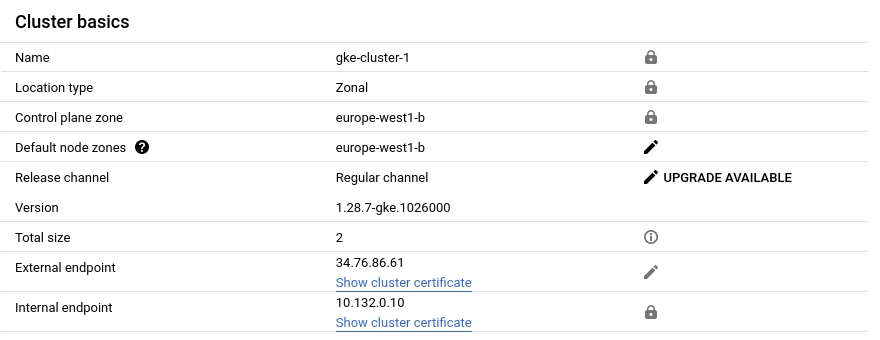
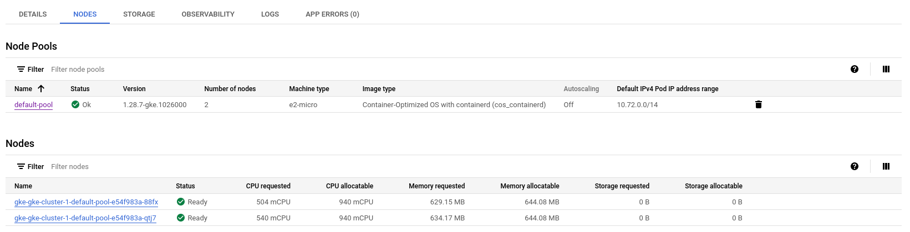
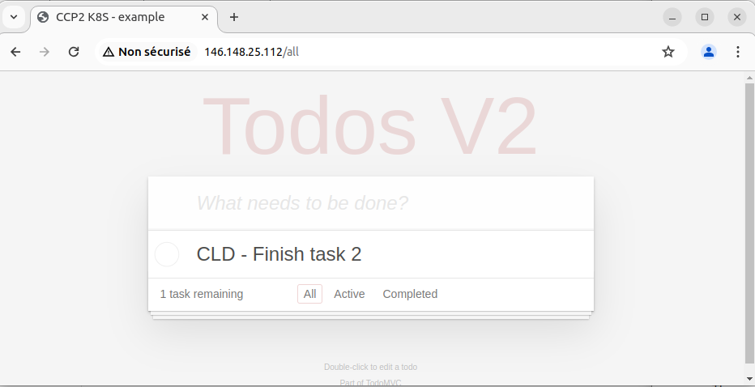

# Task 2 - Deploy the application in Kubernetes Engine

In this task you will deploy the application in the public cloud service Google Kubernetes Engine (GKE).

## Subtask 2.1 - Create Project

Log in to the Google Cloud console at <http://console.cloud.google.com/>, navigate to the __Resource Manager__ (<https://console.cloud.google.com/cloud-resource-manager>) and create a new project. 

## Subtask 2.2 - Create a cluster

Go to the Google Kubernetes Engine (GKE) console (<https://console.cloud.google.com/kubernetes/>). If necessary, enable the Kubernetes Engine API. Then create a cluster. 

* Choose a __GKE Standard__ cluster. (Please ensure that you are not using the Autopilot. The button to switch to Standard could be a bit tricky to find...)
* Give it a __name__ of the form _gke-cluster-1_
* Select a __region__ close to you.
* Set the __number of nodes__ to 2. 
* Set the __instance type__ to micro instances.
* Set the __boot disk size__ to 10 GB.
* Keep the other settings at their default values.

## Subtask 2.3 - Deploy the application on the cluster

Once the cluster is created, the GKE console will show a __Connect__ button next to the cluster in the cluster list. Click on it. A dialog will appear with a command-line command. Copy/paste the command and execute it on your local machine. This will download the configuration info of the cluster to your local machine (this is known as a _context_). It also changes the current context of your `kubectl` tool to the new cluster.

To see the available contexts, type :

```sh
$ kubectl config get-contexts
```

You should see two contexts, one for the Minikube cluster and one for the GKE cluster. The current context has a star `*` in front of it. The `kubectl` commands that you type from now on will go to the cluster of the current context.

With that you can use `kubectl` to manage your GKE cluster just as you did in task 1. Repeat the application deployment steps of task 1 on your GKE cluster.

Should you want to switch contexts, use :

```sh
$ kubectl config use-context <context>
```

## Subtask 2.4 - Deploy the ToDo-Frontend Service

On the Minikube cluster we did not have the possibility to expose a service on an external port, that is why we did not create a Service for the Frontend. Now, with the GKE cluster, we are able to do that.

Using the `redis-svc.yaml` file as an example, create the `frontend-svc.yaml` configuration file for the Frontend Service.

Unlike the Redis and API Services the Frontend needs to be accessible from outside the Kubernetes cluster as a regular web server on port 80.

  * We need to change a configuration parameter. Our cluster runs on the GKE cloud and we want to use a GKE load balancer to expose our service.
  * Read the section "Publishing Services - Service types" of the K8s documentation 
    <https://kubernetes.io/docs/concepts/services-networking/service/#publishing-services-service-types>
  * Deploy the Service using `kubectl`.

This will trigger the creation of a load balancer on GKE. This might take some minutes. You can monitor the creation of the load balancer using `kubectl describe`.

### Verify the ToDo application

Now you can verify if the ToDo application is working correctly.

  * Find out the public URL of the Frontend Service load balancer using `kubectl describe`.
  * Access the public URL of the Service with a browser. You should be able to access the complete application and create a new ToDo.


## Deliverables

Document any difficulties you faced and how you overcame them. Copy the object descriptions into the lab report (if they are unchanged from the previous task just say so).

The google interface isn't super responsive and sometimes there have been display bugs.

When I created the first cluster I set the region to europe-west1 and it wouldn't deploy for 2 hours and I couldn't delete the cluster. After a while it unblocked but with an error. I put it in the europe-west1-b zone and there I had no problem.

```
# frontend-svc.yaml
```
[api-svc](./files/api-svc.yaml)

Take a screenshot of the cluster details from the GKE console. Copy the output of the `kubectl describe` command to describe your load balancer once completely initialized.



```
[Input]
kubectl describe service/frontend-svc
[Output]
Name:                     frontend-svc
Namespace:                default
Labels:                   component=frontend
Annotations:              cloud.google.com/neg: {"ingress":true}
Selector:                 app.kubernetes.io/name=todo,component=frontend
Type:                     LoadBalancer
IP Family Policy:         SingleStack
IP Families:              IPv4
IP:                       10.71.228.254
IPs:                      10.71.228.254
LoadBalancer Ingress:     146.148.25.112
Port:                     frontend  80/TCP
TargetPort:               8080/TCP
NodePort:                 frontend  30444/TCP
Endpoints:                10.72.0.6:8080
Session Affinity:         None
External Traffic Policy:  Cluster
Events:
  Type    Reason                Age   From                Message
  ----    ------                ----  ----                -------
  Normal  EnsuringLoadBalancer  13m   service-controller  Ensuring load balancer
  Normal  EnsuredLoadBalancer   13m   service-controller  Ensured load balancer
```


## Installation step - CLI

#### Create cluster
```sh
gcloud beta container --project "cldkue" clusters create "gke-cluster-1" --no-enable-basic-auth --cluster-version "1.28.7-gke.1026000" --release-channel "regular" --machine-type "e2-micro" --image-type "COS_CONTAINERD" --disk-type "pd-balanced" --disk-size "10" --metadata disable-legacy-endpoints=true --scopes "https://www.googleapis.com/auth/devstorage.read_only","https://www.googleapis.com/auth/logging.write","https://www.googleapis.com/auth/monitoring","https://www.googleapis.com/auth/servicecontrol","https://www.googleapis.com/auth/service.management.readonly","https://www.googleapis.com/auth/trace.append" --num-nodes "2" --logging=SYSTEM,WORKLOAD --monitoring=SYSTEM --enable-ip-alias --network "projects/cldkue/global/networks/default" --subnetwork "projects/cldkue/regions/europe-west1/subnetworks/default" --no-enable-intra-node-visibility --default-max-pods-per-node "110" --security-posture=standard --workload-vulnerability-scanning=disabled --no-enable-master-authorized-networks --addons HorizontalPodAutoscaling,HttpLoadBalancing,GcePersistentDiskCsiDriver --enable-autoupgrade --enable-autorepair --max-surge-upgrade 1 --max-unavailable-upgrade 0 --binauthz-evaluation-mode=DISABLED --enable-managed-prometheus --enable-shielded-nodes --node-locations "europe-west1-b"
```


#### Download the configuration info of the cluster to your local machine 
```sh
[Input]
gcloud container clusters get-credentials gke-cluster-1 --zone europe-west1-b --project cldkue

[Output]
Fetching cluster endpoint and auth data.
kubeconfig entry generated for gke-cluster-1.

[Check input]
kubectl config get-contexts

[Check output]
CURRENT   NAME                                      CLUSTER                                   AUTHINFO                                  NAMESPACE
*         gke_cldkue_europe-west1-b_gke-cluster-1   gke_cldkue_europe-west1-b_gke-cluster-1   gke_cldkue_europe-west1-b_gke-cluster-1   
          minikube                                  minikube                                  minikube                                  default
```

#### Deploy and check redis pod
```sh
[Input]
kubectl create -f files/redis-pod.yaml

[Output]
pod/redis created

[Check input]
kubectl describe pod/redis

[Check output]
Name:             redis
Namespace:        default
Priority:         0
Service Account:  default
Node:             gke-gke-cluster-1-default-pool-e54f983a-qtj7/10.132.0.12
Start Time:       Mon, 13 May 2024 18:22:35 +0200
Labels:           app=todo
                  component=redis
Annotations:      <none>
Status:           Running
IP:               10.72.1.8
IPs:
  IP:  10.72.1.8
Containers:
  redis:
    Container ID:  containerd://e236a2d55506f97dae8c3ab2a299088a47f65f3f3dd405d045689bb87b9bf067
    Image:         redis
    Image ID:      docker.io/library/redis@sha256:f14f42fc7e824b93c0e2fe3cdf42f68197ee0311c3d2e0235be37480b2e208e6
    Port:          6379/TCP
    Host Port:     0/TCP
    Args:
      redis-server
      --requirepass ccp2
      --appendonly yes
    State:          Running
      Started:      Mon, 13 May 2024 18:22:42 +0200
    Ready:          True
    Restart Count:  0
    Environment:    <none>
    Mounts:
      /var/run/secrets/kubernetes.io/serviceaccount from kube-api-access-gs22z (ro)
Conditions:
  Type              Status
  Initialized       True 
  Ready             True 
  ContainersReady   True 
  PodScheduled      True 
Volumes:
  kube-api-access-gs22z:
    Type:                    Projected (a volume that contains injected data from multiple sources)
    TokenExpirationSeconds:  3607
    ConfigMapName:           kube-root-ca.crt
    ConfigMapOptional:       <nil>
    DownwardAPI:             true
QoS Class:                   BestEffort
Node-Selectors:              <none>
Tolerations:                 node.kubernetes.io/not-ready:NoExecute op=Exists for 300s
                             node.kubernetes.io/unreachable:NoExecute op=Exists for 300s
Events:
  Type    Reason     Age   From               Message
  ----    ------     ----  ----               -------
  Normal  Scheduled  42m   default-scheduler  Successfully assigned default/redis to gke-gke-cluster-1-default-pool-e54f983a-qtj7
  Normal  Pulling    42m   kubelet            Pulling image "redis"
  Normal  Pulled     42m   kubelet            Successfully pulled image "redis" in 5.279s (5.28s including waiting)
  Normal  Created    42m   kubelet            Created container redis
  Normal  Started    42m   kubelet            Started container redis
```

#### Deploy and check redis service
```sh
[Input]
kubectl create -f files/redis-svc.yaml

[Output]
service/redis-svc created

[Check input]
kubectl describe service/redis-svc

[Check output]
Name:              redis-svc
Namespace:         default
Labels:            component=redis
Annotations:       cloud.google.com/neg: {"ingress":true}
Selector:          app=todo,component=redis
Type:              ClusterIP
IP Family Policy:  SingleStack
IP Families:       IPv4
IP:                10.71.239.222
IPs:               10.71.239.222
Port:              redis  6379/TCP
TargetPort:        6379/TCP
Endpoints:         10.72.1.8:6379
Session Affinity:  None
Events:            <none>
```

#### Deploy and check TODO-API pod
```sh
[Input]
kubectl create -f files/api-pod.yaml

[Output]
pod/api created

[Check input]
kubectl describe pod/api

[Check output]
Name:             api
Namespace:        default
Priority:         0
Service Account:  default
Node:             gke-gke-cluster-1-default-pool-e54f983a-qtj7/10.132.0.12
Start Time:       Mon, 13 May 2024 18:23:22 +0200
Labels:           app=todo
                  component=api
Annotations:      <none>
Status:           Running
IP:               10.72.1.9
IPs:
  IP:  10.72.1.9
Containers:
  api:
    Container ID:   containerd://670600096120be787b4420fc79387510d81e2bafe9368ad30b7072bc7f6db981
    Image:          icclabcna/ccp2-k8s-todo-api
    Image ID:       docker.io/icclabcna/ccp2-k8s-todo-api@sha256:13cb50bc9e93fdf10b4608f04f2966e274470f00c0c9f60815ec8fc987cd6e03
    Port:           8081/TCP
    Host Port:      0/TCP
    State:          Running
      Started:      Mon, 13 May 2024 18:23:48 +0200
    Ready:          True
    Restart Count:  0
    Environment:
      REDIS_ENDPOINT:  redis-svc
      REDIS_PWD:       ccp2
    Mounts:
      /var/run/secrets/kubernetes.io/serviceaccount from kube-api-access-zndst (ro)
Conditions:
  Type              Status
  Initialized       True 
  Ready             True 
  ContainersReady   True 
  PodScheduled      True 
Volumes:
  kube-api-access-zndst:
    Type:                    Projected (a volume that contains injected data from multiple sources)
    TokenExpirationSeconds:  3607
    ConfigMapName:           kube-root-ca.crt
    ConfigMapOptional:       <nil>
    DownwardAPI:             true
QoS Class:                   BestEffort
Node-Selectors:              <none>
Tolerations:                 node.kubernetes.io/not-ready:NoExecute op=Exists for 300s
                             node.kubernetes.io/unreachable:NoExecute op=Exists for 300s
Events:
  Type    Reason     Age   From               Message
  ----    ------     ----  ----               -------
  Normal  Scheduled  47m   default-scheduler  Successfully assigned default/api to gke-gke-cluster-1-default-pool-e54f983a-qtj7
  Normal  Pulling    47m   kubelet            Pulling image "icclabcna/ccp2-k8s-todo-api"
  Normal  Pulled     46m   kubelet            Successfully pulled image "icclabcna/ccp2-k8s-todo-api" in 24.391s (24.391s including waiting)
  Normal  Created    46m   kubelet            Created container api
  Normal  Started    46m   kubelet            Started container api
```

#### Deploy and check TODO-API service
```sh
[Input]
kubectl create -f files/api-svc.yaml

[Output]
service/api-svc created

[Check input]
kubectl describe svc/api-svc

[Check output]
Name:              api-svc
Namespace:         default
Labels:            component=api
Annotations:       cloud.google.com/neg: {"ingress":true}
Selector:          app=todo,component=api
Type:              ClusterIP
IP Family Policy:  SingleStack
IP Families:       IPv4
IP:                10.71.230.80
IPs:               10.71.230.80
Port:              api  8081/TCP
TargetPort:        8081/TCP
Endpoints:         10.72.1.9:8081
Session Affinity:  None
Events:            <none>
```

#### Deploy and check frontend pod
````sh
[Input]
kubectl create -f frontend-pod.yaml

[Output]
pod/frontend created

[Check input]
kubectl describe pod/frontend


[Check output]
Name:             frontend
Namespace:        default
Priority:         0
Service Account:  default
Node:             gke-gke-cluster-1-default-pool-e54f983a-88fx/10.132.0.11
Start Time:       Mon, 13 May 2024 18:24:32 +0200
Labels:           app.kubernetes.io/name=todo
                  component=frontend
Annotations:      <none>
Status:           Running
IP:               10.72.0.6
IPs:
  IP:  10.72.0.6
Containers:
  frontend:
    Container ID:   containerd://591c0efda240831c98104c11a91048d62e139b681ec52ff0804dacff6b6b89b6
    Image:          icclabcna/ccp2-k8s-todo-frontend
    Image ID:       docker.io/icclabcna/ccp2-k8s-todo-frontend@sha256:5892b8f75a4dd3aa9d9cf527f8796a7638dba574ea8e6beef49360a3c67bbb44
    Port:           8080/TCP
    Host Port:      0/TCP
    State:          Running
      Started:      Mon, 13 May 2024 18:25:06 +0200
    Ready:          True
    Restart Count:  0
    Environment:
      API_ENDPOINT_URL:  http://api-svc:8081
    Mounts:
      /var/run/secrets/kubernetes.io/serviceaccount from kube-api-access-9ntfx (ro)
Conditions:
  Type              Status
  Initialized       True 
  Ready             True 
  ContainersReady   True 
  PodScheduled      True 
Volumes:
  kube-api-access-9ntfx:
    Type:                    Projected (a volume that contains injected data from multiple sources)
    TokenExpirationSeconds:  3607
    ConfigMapName:           kube-root-ca.crt
    ConfigMapOptional:       <nil>
    DownwardAPI:             true
QoS Class:                   BestEffort
Node-Selectors:              <none>
Tolerations:                 node.kubernetes.io/not-ready:NoExecute op=Exists for 300s
                             node.kubernetes.io/unreachable:NoExecute op=Exists for 300s
Events:
  Type    Reason     Age   From               Message
  ----    ------     ----  ----               -------
  Normal  Scheduled  57m   default-scheduler  Successfully assigned default/frontend to gke-gke-cluster-1-default-pool-e54f983a-88fx
  Normal  Pulling    57m   kubelet            Pulling image "icclabcna/ccp2-k8s-todo-frontend"
  Normal  Pulled     57m   kubelet            Successfully pulled image "icclabcna/ccp2-k8s-todo-frontend" in 31.017s (31.018s including waiting)
  Normal  Created    57m   kubelet            Created container frontend
  Normal  Started    57m   kubelet            Started container frontend
```

#### Deploy and check frontend service
```sh
[Input]
kubectl create -f frontend-svc.yaml

[Output]
service/frontend-svc created

[Check input]
kubectl describe service/frontend-svc

[Check output]
Name:                     frontend-svc
Namespace:                default
Labels:                   component=frontend
Annotations:              cloud.google.com/neg: {"ingress":true}
Selector:                 app.kubernetes.io/name=todo,component=frontend
Type:                     LoadBalancer
IP Family Policy:         SingleStack
IP Families:              IPv4
IP:                       10.71.228.254
IPs:                      10.71.228.254
LoadBalancer Ingress:     146.148.25.112
Port:                     frontend  80/TCP
TargetPort:               8080/TCP
NodePort:                 frontend  30444/TCP
Endpoints:                10.72.0.6:8080
Session Affinity:         None
External Traffic Policy:  Cluster
Events:
  Type    Reason                Age   From                Message
  ----    ------                ----  ----                -------
  Normal  EnsuringLoadBalancer  56m   service-controller  Ensuring load balancer
  Normal  EnsuredLoadBalancer   56m   service-controller  Ensured load balancer
````

