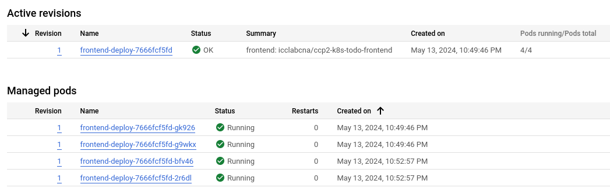
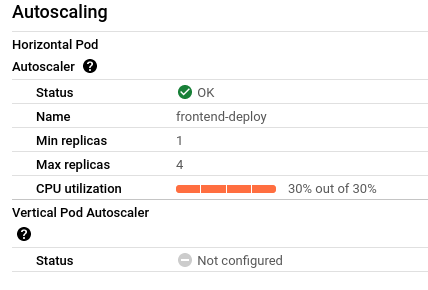

# Task 3 - Add and exercise resilience

By now you should have understood the general principle of configuring, running and accessing applications in Kubernetes. However, the above application has no support for resilience. If a container (resp. Pod) dies, it stops working. Next, we add some resilience to the application.

## Subtask 3.1 - Add Deployments

In this task you will create Deployments that will spawn Replica Sets as health-management components.

Converting a Pod to be managed by a Deployment is quite simple.

  * Have a look at an example of a Deployment described here: <https://kubernetes.io/docs/concepts/workloads/controllers/deployment/>

  * Create Deployment versions of your application configurations (e.g. `redis-deploy.yaml` instead of `redis-pod.yaml`) and modify/extend them to contain the required Deployment parameters.

  * Again, be careful with the YAML indentation!

  * Make sure to have always 2 instances of the API and Frontend running. 

  * Use only 1 instance for the Redis-Server. Why?

    > Using just one instance for the Redis-Server ensures that all data remains centralized in a single location. If there were multiple instances or replicas, we would need to manage and synchronize data across different containers, which is not necessary with a single instance.

  * Delete all application Pods (using `kubectl delete pod ...`) and replace them with deployment versions.

  * Verify that the application is still working and the Replica Sets are in place. (`kubectl get all`, `kubectl get pods`, `kubectl describe ...`)

## Subtask 3.2 - Verify the functionality of the Replica Sets

In this subtask you will intentionally kill (delete) Pods and verify that the application keeps working and the Replica Set is doing its task.

Hint: You can monitor the status of a resource by adding the `--watch` option to the `get` command. To watch a single resource:

```sh
$ kubectl get <resource-name> --watch
```

To watch all resources of a certain type, for example all Pods:

```sh
$ kubectl get pods --watch
```

You may also use `kubectl get all` repeatedly to see a list of all resources.  You should also verify if the application stays available by continuously reloading your browser window.

  * What happens if you delete a Frontend or API Pod? How long does it take for the system to react?
    > we can check the status of the pod with the command kubectl get pods --watch
    >
    > kubectl get pods --watch
    > NAME                                READY   STATUS        RESTARTS   AGE
    > api-deployment-6969bc9997-2wpq6     1/1     Running       0          11m
    > api-deployment-6969bc9997-9r8q7     1/1     Running       0          11m
    > frontend-deploy-6f55bbc9c9-qbdnj    1/1     Running       0          11m
    > frontend-deploy-6f55bbc9c9-zsmmb    1/1     Running       0          11m
    > redis-deployment-5ffcf7fbfc-z9wkw   1/1     Running       0          3m
    >
    >
    > If we delete one of the pod the status will be in `Terminating` state and then will be deleted an other pod will be created almost instantaneously, in less than a second .
    
  * What happens when you delete the Redis Pod?

    > As expected, the service will still be online because the system will delete the pod and create another one instantly, but the data that was stored on the old pod will be permanently lost because the data is stored on it.  But if the api pod was started before redis, there is an error when transmitting the api to redis. To correct this, you need to restart the api deployment. `kubectl delete replicaset.apps/api-deployment-xxxxxxxxxx`
    
  * How can you change the number of instances temporarily to 3? Hint: look for scaling in the deployment documentation

    > kubectl scale deployment.apps/api-deployment --replicas=3
    
  * What autoscaling features are available? Which metrics are used?

    > Horizontal Pod Autoscaler: horizontal autoscaling by increasing the number of pods
    >
    > Vertical Pod Autoscaling: Increase pod resources directly
    >
    > Use of CPU, memory, network, etc.
    
  * How can you update a component? (see "Updating a Deployment" in the deployment documentation)

    > kubectl patch pod/redis --patch-file [yaml file containing the changes to be applied]

## Subtask 3.3 - Put autoscaling in place and load-test it

On the GKE cluster deploy autoscaling on the Frontend with a target CPU utilization of 30% and number of replicas between 1 and 4. 

Load-test using Vegeta (500 requests should be enough).

> [!NOTE]
>
> - The autoscale may take a while to trigger.
>
> - If your autoscaling fails to get the cpu utilization metrics, run the following command
>
>   - ```sh
>     $ kubectl apply -f https://github.com/kubernetes-sigs/metrics-server/releases/latest/download/components.yaml
>     ```
>
>   - Then add the *resources* part in the *container part* in your `frontend-deploy` :
>
>   - ```yaml
>     spec:
>       containers:
>         - ...:
>           env:
>             - ...:
>           resources:
>             requests:
>               cpu: 10m
>     ```
>

## Deliverables

Document your observations in the lab report. Document any difficulties you faced and how you overcame them. Copy the object descriptions into the lab report.

> We spent a lot of time trying to figure out why the redis pod couldn't communicate with the api.
>
> As indicated, it is not possible to view the autoscale directly with the default dashboard, but using the indicate command you can see that the autoscale is working as expected.





```yaml
# redis-deploy.yaml
```

[redis-deploy.yaml](./files/redis-deploy.yaml)

```yaml
# api-deploy.yaml
```

[api-deploy.yaml](./files/api-deploy.yaml)

```yaml
# frontend-deploy.yaml
```

[frontend-deploy.yaml](./files/frontend-deploy.yaml)